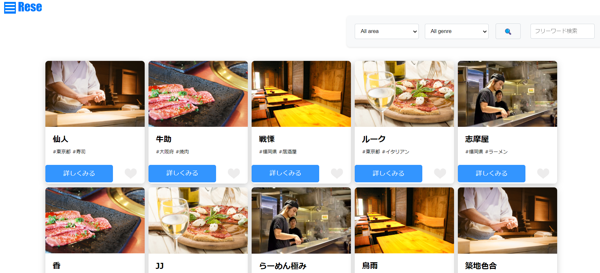
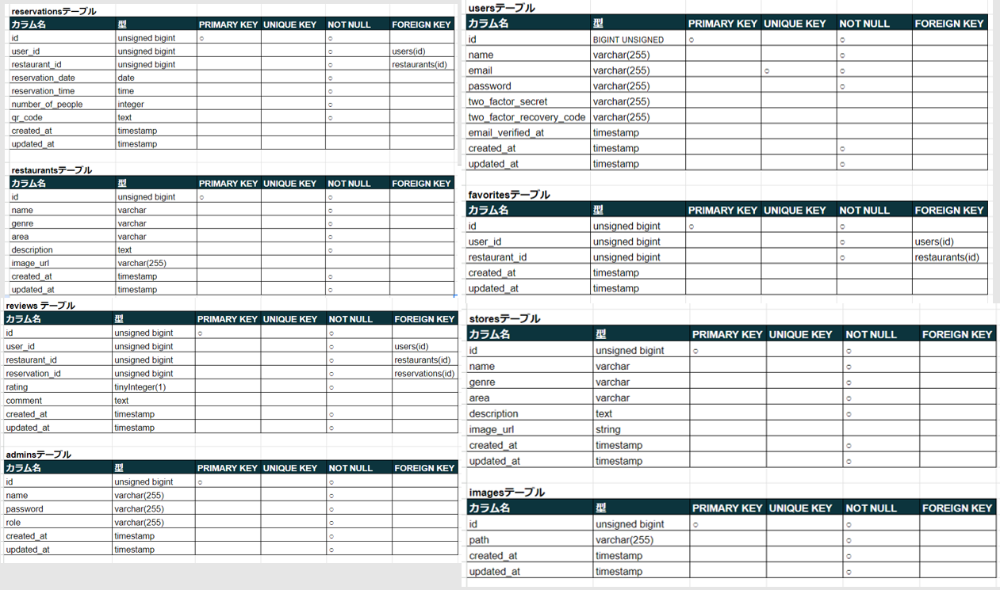
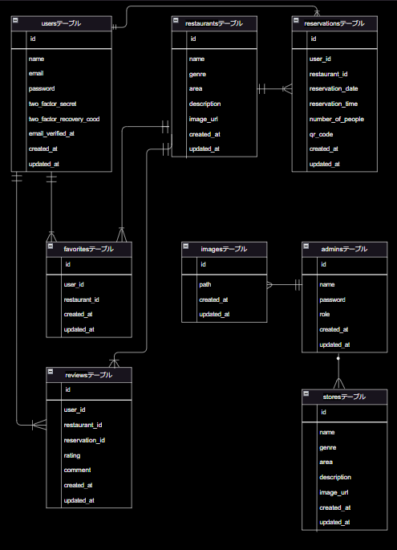

# Reservation-System
 飲食店予約システム
 飲食店への予約システムを今回作成しました。ログイン後に店舗予約やお気に入りの追加、解除、予約店舗へのレビューの投稿ができます。
予約操作時に支払い決済機能Stripeを取り入れました。予約確定時にリマインダーメールに予約情報と情報参照用のQRコードが予約者へ送信する。

 ## 作成目的
 学習した内容のアウトプットや自身でも検索能力向上も含めて作成しました。

 ## URL
 http://54.199.123.15
 
 ## 機能一覧　
 ログイン機能　会員登録　ユーザー情報取得　ユーザー飲食店お気に入り一覧取得
 ユーザー飲食店予約情報取得　飲食店一覧取得　飲食店詳細取得　
 飲食店お気に入り追加・削除　飲食店予約情報追加・削除　
 エリア・ジャンル・店名で検索機能　予約変更機能　評価レビュー機能
 管理機能実装　ストレージ機能　メール認証　お知らせメール機能
 予約情報のリマインダーメール機能　
 
 ## 仕様技術
 docker、Laravel8.x、PHP7.3、laravel-fortify、simplesoftwareio-simple-qrcode4.2、stripe15.5、guzzlehttp7.0
 
 ## テーブル設計

 ## ER図
 

 ## 環境構築

 ##　備考欄
